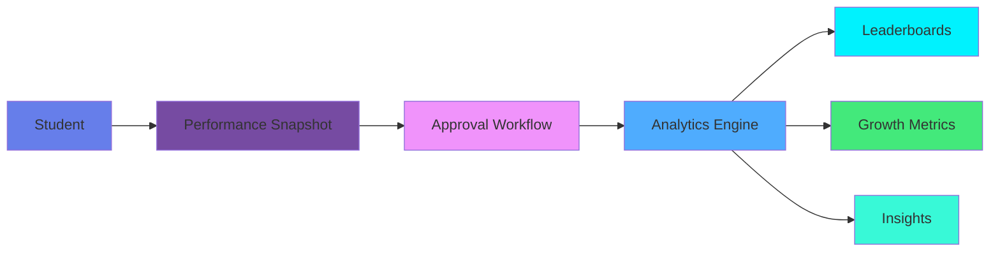
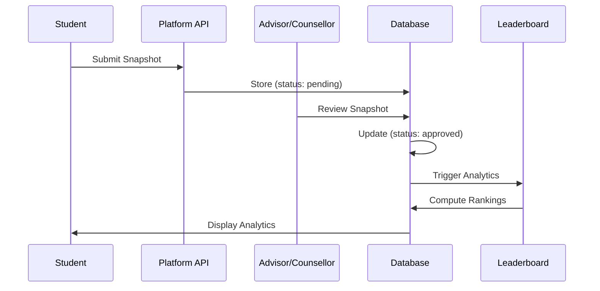

# 🎓 CodeLens

<div align="center">

**Open-Source Student Coding Performance Analytics Platform**

[](https://opensource.org/licenses/MIT)
[](https://www.python.org/downloads/)
[](https://flask.palletsprojects.com/)
[](https://www.postgresql.org/)
[](https://reactjs.org/)
[](https://www.docker.com/)
[](https://github.com/sangsaist/codelens/pulls)

[Features](#-features) • [Quick Start](#-quick-start) • [Documentation](#-documentation) • [Contributing](#-contributing)

</div>

---

## 📖 Table of Contents

- [Overview](#-overview)
- [The Problem](#-the-problem)
- [Our Solution](#-our-solution)
- [Key Features](#-features)
- [System Architecture](#-system-architecture)
- [Technology Stack](#-technology-stack)
- [Quick Start](#-quick-start)
- [API Documentation](#-api-documentation)
- [Security](#-security)
- [Roadmap](#-roadmap)
- [Contributing](#-contributing)
- [License](#-license)

---

## 🌟 Overview

**CodeLens** is a comprehensive analytics platform designed for educational institutions to track, analyze, and improve students' coding proficiency through structured performance snapshots, data-driven insights, and dynamic leaderboards.

### 🎯 Mission

Transform manual, inconsistent coding performance tracking into a **structured, measurable, transparent system** that enables data-driven student development and mentoring at institutional scale.

### 🏛️ Deployment Model

- **Self-Hosted**: Each college deploys its own instance
- **Single-Tenant**: Complete data isolation per institution
- **Scalable**: Handles 500–5000+ students per deployment

---

## 💡 The Problem

Most educational institutions face critical challenges in coding education management:

<table>
<tr>
<td width="50%">

### ❌ **Current State**
- ✗ Manual spreadsheet tracking
- ✗ No historical performance data
- ✗ Inconsistent measurement across departments
- ✗ No visibility into student progress
- ✗ Time-consuming data collection
- ✗ No analytics-driven mentoring

</td>
<td width="50%">

### ✅ **With CodeLens**
- ✓ Automated performance tracking
- ✓ Complete historical timeline
- ✓ Standardized metrics institution-wide
- ✓ Real-time dashboards for all stakeholders
- ✓ One-time setup, continuous tracking
- ✓ Data-driven insights and recommendations

</td>
</tr>
</table>

---

## 🚀 Our Solution

### **Snapshot-Driven Architecture**



### **Core Philosophy**

> **Snapshots are the source of truth.**  
> Analytics are computed from snapshots.  
> Leaderboards are generated from analytics.

This separation ensures **scalability**, **clarity**, and **long-term maintainability**.

---

## ✨ Features

<div align="center">

| 🔐 Authentication | 👥 Role Management | 📊 Analytics | 🏆 Leaderboards |
|:-----------------:|:------------------:|:------------:|:---------------:|
| JWT-based auth | 5-tier hierarchy | Growth tracking | Class/Dept/Institution |
| Secure password hashing | Multi-role support | Weekly/Monthly metrics | Real-time rankings |
| Session management | Permission enforcement | Historical trends | Multi-platform aggregation |

</div>

### 🎓 **For Students**
- 📈 Track progress across multiple platforms (LeetCode, Codeforces, etc.)
- 📊 View personal analytics and growth metrics
- 🏅 See class/department rankings
- 📅 Historical performance timeline

### 👨‍🏫 **For Advisors**
- 👀 Monitor assigned students' progress
- ✅ Approve/reject performance snapshots
- 📉 Identify struggling students early
- 📋 Batch approval workflows

### 🧑‍💼 **For Counsellors**
- 🏢 Department-wide analytics
- 📊 Comparative performance analysis
- 🎯 Identify at-risk students
- 📈 Track cohort improvement

### 👔 **For HODs**
- 🏛️ Department management
- 👥 Staff & student assignment
- 📊 Department-level insights
- 📈 Placement readiness tracking

### 🛡️ **For Admins**
- ⚙️ System configuration
- 👤 User management
- 🏢 Department setup
- 🔍 Institution-wide analytics

---

## 🏗️ System Architecture

### **High-Level Architecture**

```
┌─────────────────────────────────────────────────────────────┐
│                     Client Layer (React SPA)                 │
│  Components • Pages • Routes • State Management • API Client │
└────────────────────────┬────────────────────────────────────┘
                         │ HTTPS/REST API
┌────────────────────────▼────────────────────────────────────┐
│                  Application Layer (Flask)                   │
│  ┌──────────┬──────────┬──────────┬──────────┬──────────┐  │
│  │   Auth   │ Students │ Snapshots│ Analytics│  Admin   │  │
│  │ Blueprint│ Blueprint│ Blueprint│ Blueprint│ Blueprint│  │
│  └──────────┴──────────┴──────────┴──────────┴──────────┘  │
│  ┌──────────────────────────────────────────────────────┐  │
│  │  Business Logic • Authorization • Validation         │  │
│  └──────────────────────────────────────────────────────┘  │
└────────────────────────┬────────────────────────────────────┘
                         │ SQLAlchemy ORM
┌────────────────────────▼────────────────────────────────────┐
│                  Database Layer (PostgreSQL)                 │
│  Users • Students • Departments • Snapshots • Analytics     │
└─────────────────────────────────────────────────────────────┘
```

### **Data Flow**



---

## 🛠️ Technology Stack

<div align="center">

### **Backend**


### **Frontend**


### **DevOps**


</div>

| Layer | Technology | Purpose |
|-------|-----------|---------|
| **Runtime** | Python 3.10+ | Server-side language |
| **Framework** | Flask 3.1.2 | Web application framework |
| **Database** | PostgreSQL 15 | Relational data storage |
| **ORM** | SQLAlchemy 2.0 | Database abstraction |
| **Migration** | Alembic | Schema versioning |
| **Auth** | Flask-JWT-Extended | JWT token management |
| **Password** | bcrypt | Password hashing |
| **Frontend** | React 18 + Vite | UI library + build tool |
| **Styling** | Tailwind CSS | Utility-first CSS |
| **Charts** | Recharts | Data visualization |
| **Container** | Docker + Compose | Containerized deployment |
| **Proxy** | Nginx | Reverse proxy (production) |

---

## 🚀 Quick Start

### **Option 1: Docker (Recommended) — 5 Minutes**

```bash
# 1. Clone the repository
git clone https://github.com/sangsaist/codelens.git
cd codelens

# 2. Configure environment
cp .env.example .env
# Edit .env with your settings (DB password, JWT secret, etc.)

# 3. Start all services
docker-compose -f docker-compose.dev.yml up -d --build

# 4. Initialize database
docker-compose -f docker-compose.dev.yml exec backend flask db upgrade

# 5. Seed roles
docker-compose -f docker-compose.dev.yml exec backend python -c \
  "from app import create_app; from app.auth.seed import seed_roles; app = create_app(); app.app_context().push(); seed_roles()"

# 6. Generate & import test data
docker-compose -f docker-compose.dev.yml exec backend python scripts/generate_all_data.py
docker-compose -f docker-compose.dev.yml exec backend python scripts/seed_data.py

# 7. Open the app
# Frontend: http://localhost:5173
# Backend:  http://localhost:5000
```

### **Option 2: Manual Setup**

See the full [Setup Guide](docs/SETUP.md) for step-by-step manual installation.

### **Default Credentials**

| Role | Email | Password |
|------|-------|----------|
| Admin | `admin@college.edu` | `Admin@12345` |
| HOD (CSE) | `hod.cse@college.edu` | `Hod@12345` |
| Student | See `backend/data/students.csv` | `Student@123` |

> 📝 Student emails are randomly generated. Check `backend/data/students.csv` for exact emails.

---

## 📚 API Documentation

### **Core Endpoints**

| Method | Endpoint | Description | Auth |
|--------|----------|-------------|------|
| `POST` | `/auth/register` | Register new user | No |
| `POST` | `/auth/login` | Login and receive JWT | No |
| `GET` | `/analytics/my-summary` | Student dashboard data | Student+ |
| `GET` | `/analytics/institution-summary` | Institution overview | Admin/HOD |
| `GET` | `/platforms/my` | Linked platform accounts | Student+ |
| `POST` | `/platforms/link` | Link coding platform | Student+ |
| `POST` | `/snapshots` | Submit performance snapshot | Student+ |
| `GET` | `/counsellor/pending-snapshots` | Review queue | Advisor+ |
| `PUT` | `/counsellor/snapshots/<id>/approve` | Approve snapshot | Advisor+ |
| `POST` | `/staff/create` | Create staff member | Admin/HOD |
| `GET` | `/staff/my-team` | View team hierarchy | Staff+ |
| `GET` | `/academics/departments` | List departments | Any |

<details>
<summary><strong>📖 API Request/Response Examples</strong></summary>

**Login:**
```bash
curl -X POST http://localhost:5000/auth/login \
  -H "Content-Type: application/json" \
  -d '{
    "email": "admin@college.edu",
    "password": "Admin@12345"
  }'
```

**Response:**
```json
{
  "success": true,
  "message": "Login successful",
  "data": {
    "access_token": "eyJhbGciOiJIUzI1NiIsInR5cCI6IkpXVCJ9...",
    "user": {
      "id": "550e8400-e29b-41d4-a716-446655440000",
      "email": "admin@college.edu",
      "full_name": "System Administrator",
      "roles": ["admin"]
    }
  }
}
```

</details>

---

## 🔒 Security

- ✅ **JWT Authentication** – Stateless, token-based auth
- ✅ **Password Hashing** – bcrypt with salt
- ✅ **Role-Based Access Control** – 5-tier hierarchical permissions (Admin → HOD → Counsellor → Advisor → Student)
- ✅ **SQL Injection Prevention** – SQLAlchemy ORM parameterized queries
- ✅ **CORS Protection** – Configurable origin restrictions
- ✅ **Non-root Docker containers** – Least-privilege execution
- ✅ **Secrets via environment variables** – No hardcoded credentials in code

<details>
<summary><strong>⚠️ Production Security Checklist</strong></summary>

- [ ] Generate strong JWT secret: `openssl rand -hex 32`
- [ ] Set strong database password
- [ ] Restrict CORS to your institution's domain
- [ ] Configure HTTPS with valid SSL certificates
- [ ] Implement rate limiting (Flask-Limiter)
- [ ] Enable audit logging
- [ ] Set up database backups
- [ ] Keep dependencies updated

</details>

---

## 🗺️ Roadmap

> **Project started:** February 2025 — currently in active development.

### ✅ **v1.0 – Foundation** (Current)

- ✅ JWT authentication & role-based access control
- ✅ 5-tier role hierarchy (Admin, HOD, Counsellor, Advisor, Student)
- ✅ Department & academic structure management
- ✅ Student profile management
- ✅ Manual performance snapshot entry
- ✅ Snapshot approval workflow
- ✅ Basic analytics & growth metrics
- ✅ Leaderboard generation
- ✅ React frontend with role-based dashboards
- ✅ Docker dev & production deployment
- ✅ Bulk data import via CSV
- 🚧 HOD student-to-advisor assignment (in progress)

### 🔜 **v1.5 – Platform Integration** (Planned)

- 🔄 Automated LeetCode data sync
- 🔄 Automated GitHub activity tracking
- 🔄 Background job processing (Celery/Redis)
- 🔄 Snapshot auto-generation from synced data
- 🔄 Email notifications

### 📊 **v2.0 – Advanced Analytics** (Planned)

- 📊 Placement readiness scoring
- 📊 At-risk student detection
- 📊 Performance trend visualization
- 📊 Department comparative analysis
- 📊 Custom report builder

### 🤖 **v3.0 – Intelligent Insights** (Future)

- 🤖 Personalized learning recommendations
- 🤖 Predictive analytics
- 🤖 Smart mentoring suggestions
- 🤖 Automated risk alerts

---

## 📁 Project Structure

```text
codelens/
├── backend/
│   ├── app/
│   │   ├── auth/           # Login, Register, Roles
│   │   ├── staff/          # Staff Profiles (HOD, Advisor, Counsellor)
│   │   ├── academics/      # Departments & Batches
│   │   ├── students/       # Student Profiles
│   │   ├── platforms/      # External Account Linking
│   │   ├── snapshots/      # Progress Tracking
│   │   ├── analytics/      # Data Aggregation
│   │   ├── counsellor/     # Review Dashboards
│   │   ├── review/         # Approval Logic
│   │   ├── common/         # Utilities (RBAC, Responses)
│   │   ├── setup/          # Bootstrapping Scripts
│   │   └── __init__.py     # App Factory
│   ├── scripts/            # Data generation & seeding
│   ├── migrations/         # Alembic DB migrations
│   ├── data/               # Generated CSV test data
│   ├── Dockerfile
│   ├── requirements.txt
│   └── run.py
├── frontend/
│   ├── src/
│   │   ├── api/            # Axios API clients
│   │   ├── context/        # React context (Auth)
│   │   ├── hooks/          # Custom hooks
│   │   ├── pages/          # Page components
│   │   ├── routes/         # Route definitions
│   │   └── utils/          # Utility functions
│   ├── Dockerfile
│   ├── nginx.conf
│   └── package.json
├── nginx/                  # Reverse proxy (production)
├── docs/                   # Documentation
├── docker-compose.dev.yml  # Development environment
├── docker-compose.prod.yml # Production environment
├── .env.example            # Environment template
└── .gitignore
```

---

## 🤝 Contributing

Contributions are welcome! Whether it's bug reports, feature requests, or code — your input helps make CodeLens better.

1. **Fork** the repository
2. **Create** a feature branch: `git checkout -b feature/your-feature`
3. **Commit** your changes: `git commit -m 'feat: Add your feature'`
4. **Push** to the branch: `git push origin feature/your-feature`
5. **Open** a Pull Request

- 🐛 Report bugs via [GitHub Issues](https://github.com/sangsaist/codelens/issues)
- 💡 Suggest features via [GitHub Discussions](https://github.com/sangsaist/codelens/discussions)

---

## 📄 License

This project is licensed under the **MIT License** — see the [LICENSE](LICENSE) file for details.

---

## 📖 Documentation

- 📐 [Architecture](docs/ARCHITECTURE.md) – System design & data flow
- ⚙️ [Setup Guide](docs/SETUP.md) – Docker & manual installation
- 🎨 [Frontend Guide](docs/FRONTEND.md) – React components & pages

---

<div align="center">

### **Built with ❤️ for Education**

**Making Coding Education Data-Driven, One Institution at a Time**

[⬆ Back to Top](#-codelens)

---

<sub>© 2025 CodeLens. Open Source Project under MIT License.</sub>

</div>
